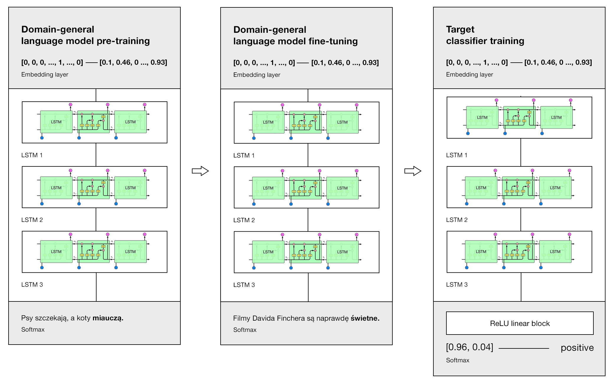

# Sentiment Classification Using Machine Learning

My Bachelor thesis in Computer Science on the subject of document-level sentiment classification using deep, recurrent neural networks in a task of binary, Polish film reviews classification. The resulting system has a classification accuracy 94,19% on a validation dataset consisting of long (over 500 words on average) film reviews from *Filmweb+* dataset.

## Thesis Summary

We have defined a problem of a document sentiment classification and provided the reader with a comprehensive background on recurrent neural network-based natural language processing, starting from important machine learning problems and ending with an perspective on impact of recent developments in the deep learning on the field of NLP.

Then, we have presented a proposed implementation of a ULMFiT-based Polish text documents sentiment classification system, based on *plwiki* and *Filmweb+* datasets, introducing various pre-training and fine-tuning strategies, regularisation and tokenization techniques, and manually selected hyperparameter values.

We have also provided a manual for a resulting document-level sentiment classification system, presenting an overview system's requirements, as well as usage of an available command-line interface for the purpose of performing an input document sentiment classification and training new classifier models.

Finally, in order to test an impact of different factors of an underlying machine learning model, we have performed and documented several experiments on a token vocabulary size, amount of labelled training data used and hyperparameters.

The main goal of this work, the design an implementation of a document-level sentiment classification system on a practical, real-world domain of Polish movie reviews has been successfully accomplished. In fact, the proposed implementation achieves a test set accuracy of 94,19%, making it a state-of-the-art result for a real-world, long text (500 words on average) document sentiment analysis task in Polish language (citations in the paper),second only to performance of neural network-based implementations performing classification on short product opinions (citations in the paper).